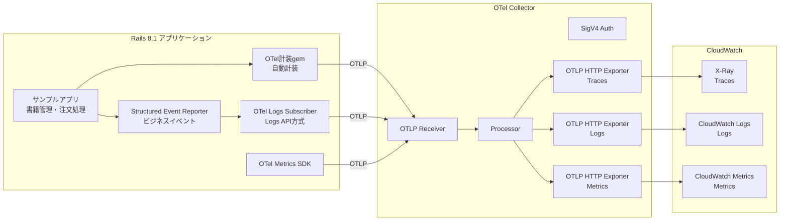
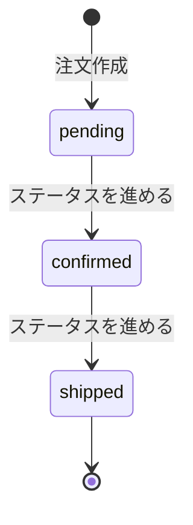

# Rails 8.1 OTel統合デモアプリ 機能設計書

**バージョン**: 1.0
**作成日**: 2026年4月12日
**更新日**: 2026年4月12日

> **設計方針**
>
> この機能設計書は、実装の詳細に影響されないコアドメインの設計を記載する。
> 具体的なクラス設計や実装詳細は実装中の改善によって変化するため、
> 以下を重視して作成する：
>
> - **責務の明確化**: 何をする処理かを明確に定義
> - **入出力の仕様**: 処理に必要な入力と期待される出力
> - **処理フローの概要**: 大まかな処理手順（実装方法は含めない）
> - **抽象度の保持**: 具体的なクラス名・メソッド名は原則記載しない。ただしOTel SDKのコンポーネント名（LoggerProvider等）はOTel仕様の標準用語であり、実装言語に依存しない概念として使用する
> - **ドメイン知識の記録**: 業務ルールやビジネス制約を重視

## 1. 機能概要

### 1.1 目的

Rails 8.1 Structured Event ReporterとOpenTelemetry、CloudWatchを統合するデモアプリケーションの実装設計を定義する。

- OTelの3シグナル（Traces, Logs, Metrics）を同時稼働させ、CloudWatchで確認できる構成を実現する
- EventReporterのビジネスイベントをOTel Logs API経由でCloudWatch Logsに送信する
- 学習・技術記事執筆に適した、理解しやすい構成にする

### 1.2 主要機能

1. **書籍管理**: 書籍のCRUD操作。OTelフレームワーク計装の動作を確認するための基本機能
2. **注文処理**: 書籍の注文作成とステータス遷移。ビジネスイベント発行とOTelトレースのデモ対象
3. **OTelテレメトリ**: 3シグナル（Traces, Logs, Metrics）の構成と、EventReporter→OTel Logs API統合
4. **インフラ**: Docker Composeによるアプリケーション・DB・OTel Collectorの一括構成

### 1.3 処理フロー概要



## 2. データ要件

### 2.1 書籍（Book）

**テーブル名**: `books`

| 項目名 | キー | データ型 | 必須 | 説明 |
|--------|------|----------|------|------|
| id | PK | bigint | ○ | 主キー |
| title | | varchar | ○ | 書籍タイトル |
| author | | varchar | ○ | 著者名 |
| price | | decimal | ○ | 価格 |
| stock | | integer | ○ | 在庫数（0以上） |
| created_at | | datetime | ○ | 作成日時 |
| updated_at | | datetime | ○ | 更新日時 |

**制約**:
- stock >= 0（在庫数は負にならない）

**データ作成/更新タイミング**:
- 書籍管理画面から作成・編集・削除
- 注文作成時にstockが減算される
- 注文が存在する書籍は削除を制限する（外部キー制約による参照整合性の保護）

### 2.2 注文（Order）

**テーブル名**: `orders`

| 項目名 | キー | データ型 | 必須 | 説明 |
|--------|------|----------|------|------|
| id | PK | bigint | ○ | 主キー |
| order_number | UK | varchar | ○ | 注文番号（ORD-{連番} 形式で自動採番） |
| book_id | FK | bigint | ○ | 書籍ID（booksテーブル参照） |
| quantity | | integer | ○ | 注文数量（1以上） |
| total_amount | | decimal | ○ | 合計金額 |
| status | | varchar | ○ | ステータス（pending/confirmed/shipped） |
| created_at | | datetime | ○ | 作成日時 |
| updated_at | | datetime | ○ | 更新日時 |

**制約**:
- FOREIGN KEY(book_id) REFERENCES books(id)（RESTRICT: 注文が存在する書籍の削除を禁止）
- UNIQUE(order_number)
- quantity >= 1
- status は pending, confirmed, shipped のいずれか
- statusの初期値は pending

**データ作成/更新タイミング**:
- 注文作成時にレコード作成（status = pending）
- 注文一覧画面からステータスを進める操作時に更新

## 3. 処理フロー

### 3.1 書籍管理

標準的なCRUD処理。特筆すべきビジネスルールはない。

| 操作 | 処理内容 | OTelシグナル |
|------|---------|-------------|
| 一覧表示 | 全書籍を取得し一覧表示 | Traces（コントローラー + DBクエリ Span） |
| 詳細表示 | 指定書籍を取得し詳細表示。`book.viewed`イベントを発行 | Traces + Logs（`book.viewed`） |
| 作成 | 書籍レコードを作成 | Traces |
| 編集 | 書籍レコードを更新 | Traces |
| 削除 | 書籍レコードを削除（注文が存在する場合は削除を拒否） | Traces |

### 3.2 注文作成

#### 3.2.1 正常系フロー

1. **入力受付**
   - 書籍IDと数量を受け取る
2. **在庫確認**
   - 対象書籍の在庫数を確認する
   - 在庫数 >= 注文数量であることを検証する
3. **注文作成（トランザクション内、在庫の排他制御を含む）**
   - 対象書籍の在庫レコードを排他ロックで取得し、同一書籍への同時注文による在庫の不整合を防止する
   - 注文番号を自動採番する（ORD-{連番} 形式）
   - 合計金額を算出する（合計金額 = 書籍の価格 × 数量）
   - 注文レコードを作成する（status = pending）
   - 書籍の在庫数を減算する（stock = stock - quantity）
4. **ビジネスイベント発行**
   - `order.created`イベントを発行する
   - 在庫減算後、残在庫数が5以下の場合 `inventory.low`イベントを発行する
5. **メトリクス記録**
   - 注文作成数カウンタを1加算する
   - 注文金額ヒストグラムに合計金額を記録する
6. **バックグラウンドジョブ投入**
   - 注文確認メール送信ジョブをキューに投入する

#### 3.2.2 異常系

| 条件 | 処理 |
|------|------|
| 在庫不足（在庫数 < 注文数量） | 注文を拒否し、在庫不足の理由を画面に表示する。在庫の減算は行わない |
| 書籍が存在しない | エラーを表示する |

### 3.3 注文ステータス変更

#### 3.3.1 正常系フロー

1. **入力受付**
   - 注文IDを受け取る
2. **ステータス遷移**
   - 現在のステータスに基づき次のステータスに進める
   - pending → confirmed、confirmed → shipped
3. **ビジネスイベント発行**
   - `order.status_changed`イベントを発行する（変更前後のステータスを含む）

#### 3.3.2 異常系

| 条件 | 処理 |
|------|------|
| 既にshippedの注文に対する操作 | 遷移不可である旨を表示する |

### 3.4 注文確認メール送信（バックグラウンドジョブ）

1. **ジョブ実行**
   - 注文IDに基づき注文情報を取得する
   - メール送信処理を実行する（デモ用途のため実際の送信は不要。ログ出力で代替）
2. **OTelトレース**
   - Active Jobの自動計装によりジョブ実行がSpanとして記録される
   - デフォルトではジョブは注文作成時とは別トレースとして記録され、Span Linkで関連付けられる（同一トレース内の親子Spanではない）

## 4. ビジネスルール

### 4.1 在庫管理

- 在庫数は0未満にならない（DB制約で保証）
- 注文作成時のみ在庫が減算される（ステータス変更時には変動しない）
- 在庫低下の閾値は5。注文による減算後に残在庫が5以下になった場合に`inventory.low`イベントを発行する

### 4.2 注文ステータス遷移



- 一方向遷移のみ許可。逆方向への遷移やキャンセルは対象外
- 遷移はスキップできない（pending → shipped は不可）

### 4.3 合計金額の算出

```
合計金額 = 書籍の価格 × 注文数量
```

- 注文作成時点の価格で計算する
- 書籍の価格が後から変更されても、既存注文の合計金額は変更しない

## 5. OTelテレメトリ設計

### 5.1 Traces（フレームワーク計装）

OTel計装gemの自動計装（`use_all`）により、以下のSpanが自動生成される:

| Spanの発生元 | Span名の例 | 説明 |
|-------------|-----------|------|
| Action Pack | HTTPリクエストのコントローラーアクション | リクエストの処理時間を計測 |
| Active Record | DBクエリ | SQLクエリの実行時間を計測 |
| Action View | テンプレートレンダリング | ビューの描画時間を計測 |
| Active Job | ジョブ実行 | バックグラウンドジョブの実行時間を計測 |

**テレメトリパイプライン**: アプリケーション → OTel SDK（BatchSpanProcessor）→ OTLP Exporter → OTel Collector → CloudWatch X-Ray

### 5.2 Logs（EventReporter → OTel Logs API統合）

#### 5.2.1 ビジネスイベント定義

| イベント名 | 発行タイミング | ペイロード |
|-----------|--------------|-----------|
| `order.created` | 注文作成成功時 | order_number, book_id, quantity, total_amount |
| `order.status_changed` | 注文ステータス変更時 | order_number, from_status, to_status |
| `book.viewed` | 書籍詳細表示時 | book_id, title |
| `inventory.low` | 在庫減算後に残在庫が5以下の時 | book_id, remaining_stock |

#### 5.2.2 Subscriber設計

EventReporterに登録するSubscriberの責務:

1. **イベント受信**: EventReporterからイベントオブジェクトを受け取る
2. **Log Record変換**: イベントのname、payload、tags、contextをOTel Log Recordの各フィールドにマッピングする
3. **OTel Logs APIへの送信**: LoggerProviderからLoggerを取得し、`on_emit`でLog Recordを送信する

**マッピング仕様**:

| EventReporterのフィールド | OTel Log Recordのフィールド | 説明 |
|-------------------------|--------------------------|------|
| name | body | イベント名（例: `order.created`） |
| payload | attributes | ビジネスデータ（キーは文字列に変換） |
| tags | attributes（`tag.`プレフィックス付き） | ドメインコンテキスト |
| context | attributes（`context.`プレフィックス付き） | リクエスト/ジョブメタデータ |
| timestamp | timestamp | ナノ秒精度タイムスタンプ |
| （自動付与） | trace_id, span_id | OTel SDKが現在のSpanコンテキストから自動付与 |

**severity**: すべてのビジネスイベントは severity_text = "INFO" とする。EventReporterにはログレベルの概念がないため、固定値とする。

**テレメトリパイプライン**: EventReporter → Subscriber → OTel Logs SDK → OTLP Exporter → OTel Collector → CloudWatch Logs

#### 5.2.3 エラーハンドリング

- Subscriberの処理中にエラーが発生した場合、EventReporterの標準エラーハンドリングに委ねる（エラーレポーターに報告され、アプリケーション処理は継続）
- OTel Logs SDKやOTLP Exporterの一時的な障害でビジネスイベントの送信に失敗しても、アプリケーションの注文処理には影響を与えない

### 5.3 Metrics（アプリケーションメトリクス）

| メトリクス名 | 種別 | 単位 | 記録タイミング | 説明 |
|-------------|------|------|--------------|------|
| orders.created | Counter | 件 | 注文作成成功時 | 累積注文作成数 |
| orders.amount | Histogram | 円 | 注文作成成功時 | 注文金額の分布 |

**テレメトリパイプライン**: アプリケーション → OTel Metrics SDK → OTLP Exporter → OTel Collector → CloudWatch Metrics

## 6. インフラ設計

### 6.1 コンテナ構成

| コンテナ | 役割 | ポート |
|---------|------|-------|
| Rails アプリケーション | サンプルアプリ + OTel SDK | 3000（HTTP） |
| PostgreSQL | データベース | 5432 |
| OTel Collector | テレメトリの受信・転送 | 4317（gRPC）, 4318（HTTP） |

### 6.2 OTel Collectorパイプライン構成

CloudWatch OTLPエンドポイントに送信するため、標準のOTLP HTTP exporterとSigV4認証拡張を組み合わせて使用する。

| パイプライン | receiver | processor | exporter | 認証 | 送信先 |
|------------|----------|-----------|----------|------|--------|
| Traces | OTLP | batch, attributes（配列属性削除） | OTLP HTTP | SigV4（service: xray） | `xray.{Region}.amazonaws.com/v1/traces` |
| Logs | OTLP | batch | OTLP HTTP | SigV4（service: logs） | `logs.{Region}.amazonaws.com/v1/logs` |
| Metrics | OTLP | batch, attributes（配列属性削除） | OTLP HTTP | SigV4（service: monitoring） | `monitoring.{Region}.amazonaws.com/v1/metrics` |

**SigV4認証拡張**: 各exporterにAWS SigV4署名を付与し、CloudWatch OTLPエンドポイントに認証済みリクエストを送信する。サービス名はエンドポイントごとに異なる（xray, logs, monitoring）。

**配列属性の削除**: CloudWatchが配列型属性をサポートしないため、`process.command_args`等の配列型属性をattributes processorで削除する。

### 6.3 環境変数

| 変数名 | 用途 | 設定先 |
|--------|------|--------|
| AWS_ACCESS_KEY_ID | AWS認証 | OTel Collector |
| AWS_SECRET_ACCESS_KEY | AWS認証 | OTel Collector |
| AWS_REGION | AWSリージョン（Metrics OTLPはPublic Preview対応の5リージョンに限定） | OTel Collector |
| DATABASE_URL | PostgreSQL接続 | Rails アプリケーション |
| OTEL_EXPORTER_OTLP_ENDPOINT | OTel Collector接続先 | Rails アプリケーション |

## 7. 画面構成

デモ用途のため、Railsのscaffold UIをベースとし、最小限の追加のみ行う。

### 7.1 書籍管理画面

| 画面 | 表示項目 | 操作 |
|------|---------|------|
| 書籍一覧 | タイトル、著者名、価格、在庫数 | 新規作成、詳細表示、編集、削除 |
| 書籍詳細 | タイトル、著者名、価格、在庫数 | 編集、削除、注文作成へのリンク |
| 書籍作成/編集 | タイトル、著者名、価格、在庫数の入力フォーム | 保存 |

### 7.2 注文画面

| 画面 | 表示項目 | 操作 |
|------|---------|------|
| 注文一覧 | 注文番号、書籍タイトル、数量、合計金額、ステータス | 詳細表示、ステータスを進める |
| 注文詳細 | 注文番号、書籍情報、数量、合計金額、ステータス | ステータスを進める |
| 注文作成 | 書籍選択、数量入力 | 注文を確定する |

### 7.3 エラー表示

| エラー条件 | 表示内容 |
|-----------|---------|
| 在庫不足 | 「在庫が不足しています。現在の在庫数: {残在庫数}」 |
| 書籍削除不可（注文あり） | 「この書籍には注文が存在するため削除できません」 |
| ステータス遷移不可 | 「この注文は既に出荷済みです」 |

---

**関連資料**:
- [要件定義書](../requirements/requirements.md)
- [用語集](../glossary/glossary.md)
- [調査報告書](../research/rails-event-reporter-otel-cloudwatch.md)

---

## 改訂履歴

| バージョン | 日付 | 変更内容 |
|------------|------|----------|
| 1.0 | 2026/04/12 | 初版作成 |
| 1.1 | 2026/04/12 | 自動品質検証の結果を反映（Collector構成修正、FK制約追加、排他制御追加等） |
